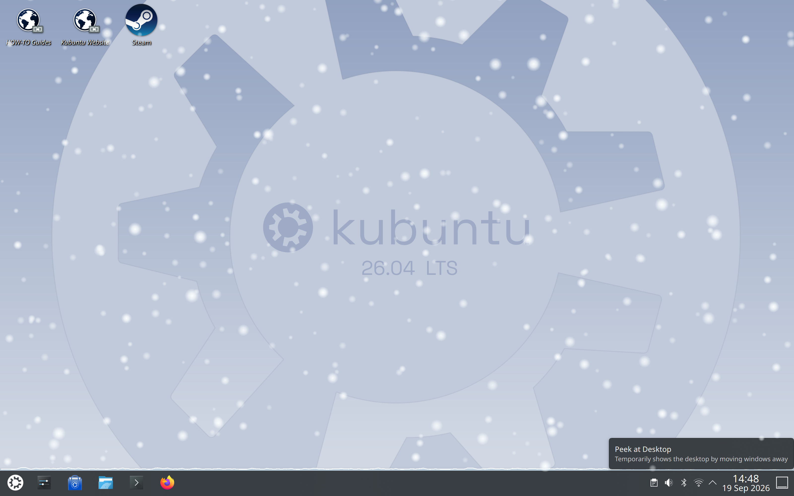
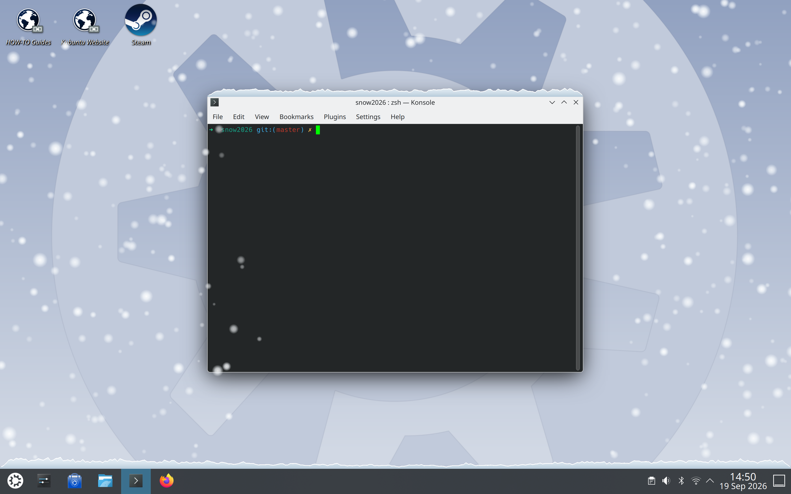

# Snow

Snow is a native C++ KWin effect for KDE Plasma. It makes snow fall over the
desktop and accumulate on the top edges of windows and panels.



Snow also settles on the top edge of ordinary windows:



The effect is disabled by default after installation. Enable it in **System
Settings → Desktop Effects → Appearance → Snow**, then use the gear button to
configure it.

## What it does

- Snow can land on windows, panels, and the desktop ground.
- Density, flake style, wind, depth, melting, and frame-rate caps are configurable.
- Snow is suspended while the session is locked or idle, and while a fullscreen window is active.

## Supported platforms

The first supported package targets are x86_64 builds of:

| Platform | KDE/Plasma and KWin line | Package |
| --- | --- | --- |
| Ubuntu/Kubuntu 26.04 LTS | Plasma 6.6, KWin 6.6.x | `.deb` from the [release page](../../releases) |
| Fedora KDE 44 | Plasma 6.7, KWin 6.7.x | `.rpm` from the [release page](../../releases) |
| Arch Linux | Rolling Plasma/KWin, currently 6.7.x | Arch package from the [release page](../../releases) |

## Installation

On Ubuntu/Kubuntu, install the `.deb` with `apt` (or open it in Discover):

```sh
sudo apt install ./kwin-effect-snow-*.deb
```

On Fedora KDE, install the `.rpm` with `dnf` (or open it in Discover):

```sh
sudo dnf install ./kwin-effect-snow-*.rpm
```

On Arch Linux, build and install the recipe with `makepkg -si` from
`packaging/arch`. For unsupported or newer distributions, [build from
source](#build-and-test) against that distribution's `kwin-dev` package.

After installation, enable Snow under **System Settings → Desktop Effects →
Appearance**. KWin may need to be restarted, or you may need to log out and
back in, before a newly installed plugin appears.

### Compatibility

Snow is a native C++ KWin plugin, not a standalone application. KWin does not
provide a stable ABI for third-party native effects, so a Plasma or KWin
upgrade can require a new package build. These packages are distribution- and
KWin-line-specific; they are not universal KDE 6 binaries.

## Build and test

This project is developed on Linux with KDE Plasma, CMake, Ninja, and a C++20
compiler. Install the build dependencies for your distribution, then run:

```sh
cmake -B build -G Ninja -DCMAKE_BUILD_TYPE=Debug
cmake --build build
ctest --test-dir build --output-on-failure
```

The complete dependency list and development workflow are in
[`docs/development.md`](docs/development.md).

## Try changes safely

Because this is a compositor plugin, the recommended development loop uses a
nested KWin session rather than the live desktop:

```sh
tools/dev.sh --panel
```

This builds and installs the plugin into the local prefix, starts an isolated
nested compositor, and runs a Plasma panel inside it. Close the nested window
to stop the session. Run `tools/dev.sh --help` for output, scale, application,
and debugging options.

Use `tools/install-live.sh` only for final verification on real hardware.

Architecture decisions and the vocabulary used by the project are documented
in [`CONTEXT.md`](CONTEXT.md) and [`docs/adr/`](docs/adr/).

## License

Snow is distributed under the GNU General Public License, version 2 or later.
See [`LICENSE`](LICENSE).
